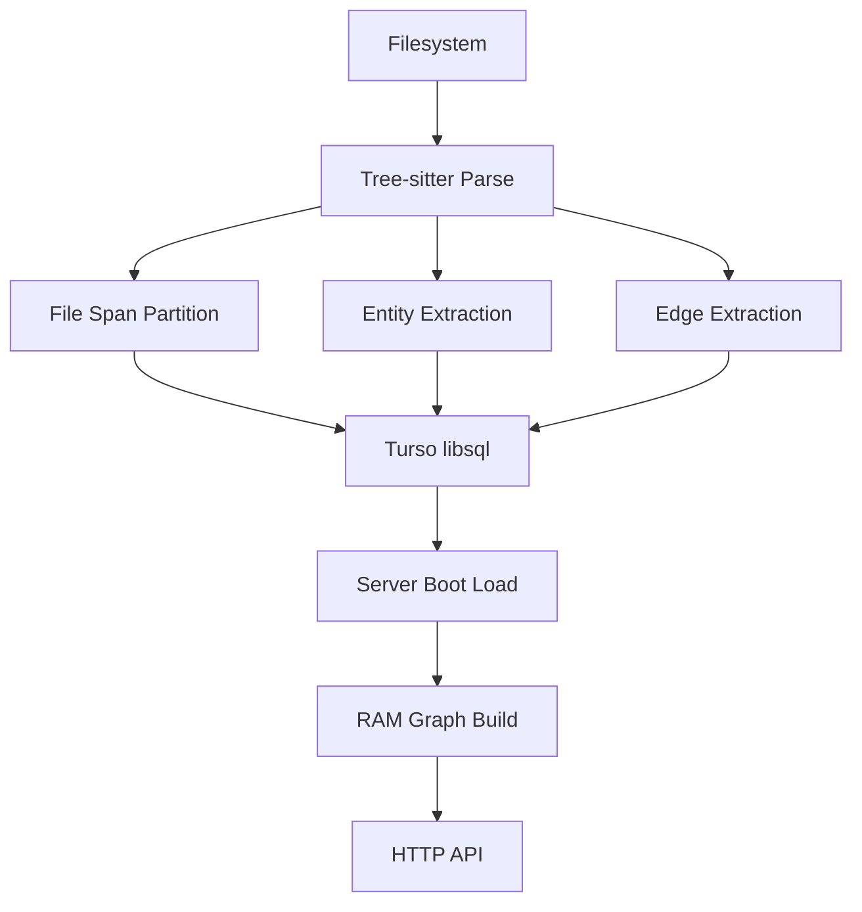

# v180-02 Architecture Simulation

**Date**: 2026-03-23
**Status**: Draft
**Purpose**: Design truth for v180 storage, runtime graph, identity, and future simulation direction

---

## 1. Architecture Thesis

Parseltongue should use:
- Turso/libsql for durable structure
- RAM for active graph computation
- exact file spans for current-snapshot truth
- integer row IDs for efficient storage references

This keeps the runtime lightweight while giving the system a durable structural memory.

---

## 2. Current Reality

Today the live server already behaves approximately like this:

```text
Turso/libsql rows
  -> load entities and edges
  -> build RAM adjacency graph
  -> run graph algorithms
  -> return HTTP JSON
```

The main architectural mismatch is that the docs and some storage shapes still reflect older assumptions.

---

## 3. Target v180 Architecture



### Durable layer responsibilities

Turso/libsql keeps:
- codebase registry
- indexed files and file hashes
- exhaustive file spans
- entities
- edges
- FTS/search support
- reloadable metadata

### RAM layer responsibilities

The in-memory runtime keeps:
- entity map
- span-key lookup map
- forward adjacency
- reverse adjacency
- visibility and metadata lookup
- any analysis structures needed by handlers

---

## 4. Identity Model

### 4.1 Durable row identity

Each entity has an integer storage key:

```text
entity_id
```

This is used for:
- foreign-key-style references in edges
- compact RAM graph construction
- efficient indexing and joins

### 4.2 Public exact identity

Each entity also has a current-snapshot span key.

Recommended shape:

```text
{language}|||{kind}|||{display_name}|||{file_path}|||{start_line}|||{end_line}
```

This is used for:
- HTTP-facing exact identity
- zooming into code
- re-opening source spans
- precise current-snapshot references

### 4.3 Continuity metadata

Semantic locator fields are stored separately for future use.

Likely fields:
- `language`
- `entity_kind`
- `scope_text`
- `display_name`
- `discriminator_text`

These are not the primary live identity in v180.

---

## 5. Exhaustive File-Span Truth

The most important storage addition in v180 is a durable file-span layer.

### Invariant

For each successfully indexed file:
- every source line belongs to exactly one persisted span segment
- span segments do not overlap
- the partition is rebuilt on reparse

This gives Parseltongue truthful current-snapshot coverage without requiring one giant final taxonomy immediately.

### Recommended durable table

```sql
file_spans(
  span_id INTEGER PRIMARY KEY,
  codebase_id INTEGER,
  file_id INTEGER,
  file_path TEXT,
  start_line INTEGER,
  end_line INTEGER,
  span_kind TEXT,
  linked_entity_id INTEGER,
  indexed_at INTEGER,
  UNIQUE(codebase_id, file_path, start_line, end_line)
)
```

`file_spans` is the exhaustive truth layer.
It exists even when a region is not a first-class entity.

---

## 6. File Invalidation Model

v180 uses file-level invalidation.

```text
file hash changes
  -> invalidate prior file rows
  -> reparse whole file
  -> rebuild file spans
  -> rebuild entities
  -> rebuild edges sourced from file
  -> commit atomically
```

This is intentionally simpler than trying to preserve partial identity inside a changed file.

---

## 7. Runtime Graph Shape

### Current shape

The current runtime graph is string-keyed adjacency.

Conceptually:

```text
forward: path:start:end -> [(path:start:end, edge_type)]
reverse: path:start:end -> [(path:start:end, edge_type)]
```

### Target shape

The v180 runtime graph should move toward integer-keyed adjacency.

Conceptually:

```text
entities: Vec<RuntimeEntity>
forward: Vec<Vec<EdgeRef>>
reverse: Vec<Vec<EdgeRef>>
```

Where each `EdgeRef` is roughly:

```text
(target_entity_id, edge_kind)
```

This is lighter in RAM and cleaner for algorithms.

---

## 8. Durable Schema Direction

### Tables

#### `codebases`
- root metadata for codebases

#### `indexed_files`
- per-file hash and indexing status

#### `file_spans`
- exhaustive file-local truth layer

#### `entities`
- graph entities with span-based current identity and semantic metadata

#### `edges`
- integer-referenced graph edges

#### `fts_entities_*`
- per-codebase search acceleration

---

## 9. HTTP Backward-Compatibility Strategy

The HTTP API stays recognizable.

What can change internally:
- storage schema
- graph build
- key-generation implementation
- edge references

What should not change casually:
- route names
- endpoint categories
- graph-oriented response intent

---

## 10. Simulation Direction After v180

v180 is not the release that ships full architecture simulation, but the design should prepare for it.

The simulation direction is:

1. represent architecture as graph state
2. apply structural mutations
3. compute exact graph deltas
4. let the LLM interpret the consequences

The core loop is:

```text
mutate -> diff -> explain
```

### Useful future mutation primitives

- `add_edge`
- `remove_edge`
- `collapse_node`
- `split_node`
- `extract_interface`

### Useful future multi-resolution layers

- crate / subsystem
- module / public interface
- function / type / impl
- selected control/data-flow slices

That future remains compatible with the v180 storage direction because exact spans, durable rows, and RAM-native graph execution are already the right substrate.

---

## 11. Relationship To Other Canonical Docs

This document is the design truth for v180.

Companion docs:
- [v180-01-prd.md](/Users/amuldotexe/Desktop/parseltongue-rust-LLM-companion/docs/v180-01-prd.md)
- [v180-03-implementation-tracker.md](/Users/amuldotexe/Desktop/parseltongue-rust-LLM-companion/docs/v180-03-implementation-tracker.md)
